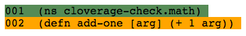
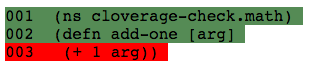

# cloverage-check

Tool for checking cloverage's reported coverage numbers.

## Demos

### A. Code on defn line with no tests is reported having 100.00% line coverage
* Make sure this is the only version of _add-one_ that is uncommented:
```
(defn add-one [arg] (+ 1 arg))
```
* Run cloverage:
```
=> lein cloverage
```
* Note the output:
```
Forms covered: 33.33 %
Lines covered: 100.00 %
```


### B. Code on own line with no tests is reported having 66.67% line coverage
* Make sure this is the only version of _add-one_ that is uncommented:
```
(defn add-one [arg] 
  (+ 1 arg))
```
* Run cloverage:
```
=> lein cloverage
```
* Note the output:
```
Forms covered: 33.33 %
Lines covered: 66.67 %
```


## License

Copyright © 2016 Jason Racey

Distributed under the Eclipse Public License either version 1.0 or (at
your option) any later version.
